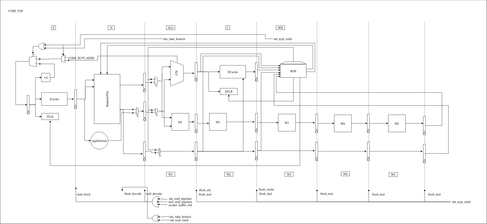

# MIRI Processor Design Core Project

Processor Description
--------------------

The architecture for each stage can be found on:
    MIRI_PA_core/figures

You can find a better description of the features supported by this core on:
    MIRI_PA_core/core_description.pdf

Infrastructure
--------------------
First, you need to open env.sh script and modify the path to verilator. Once the environment variable is properly defined we can source env.sh and proceed.

How to compile?

    make clean; 
    make verilate 2>&1 |tee build.log; 

How to run?

    ./obj_dir/Vcore_tb 100

How to open the generated waveform?
    
    gtkwave trace.fst

VERIFICATION
--------------------

The verification of this project consisted on elaborating basic tests in order to ensure 
that the next features have been implemented properly:

    GLOBAL
    ---------------------
    - Processor boots from address 0x1000
    - Exception handler is located on adress 0x2000

    INSTRUCTION SET
    ---------------------
    - R-type instructions work as expected.
    - M-type instructions work as expected.
    - Branches change the PC value properly.
    - MUL instructions have 5 cycle latency

    CACHE
    ----------------------
    - Data Cache and Instruction Cache work as expected.
    - Data Cache store buffer works as expected.
    - Memory access has 10 cycles latency

    BYPASS
    ----------------------
    - Bypasses work as expected

    EXCEPTIONS
    ----------------------
    - Next exceptions are supported:
        - iTLB miss
        - fetch bus error  
        - illegal instruction
        - ALU overflow
        - MUL overflow
        - dTlb_miss        
        - cache bus error  
        - cache address fault

    VIRTUAL MEMORY
    ----------------------
    - iTLB and dTLB work as expected.
    - Supervisor mode changes when entering on exception handler and when returning with IRET
      instruction.

    Reorder Buffer
    ----------------------
    - RoB works as expected.

Basic testing
--------------------
The basic tests have been described on:
    MIRI_PA_core/tests/note

In order to run a test the next commands should be performed:

Choose the test:
    cd MIRI_PA_core/
    cp tests/<selected_test> data_input_file.hex

Compile:

    make clean; 
    make verilate 2>&1 |tee build.log; 

Execute:

    ./obj_dir/Vcore_tb 100

Matrix Multiply test
--------------------

Matrices A and B are generated randomly. Then they are used to compute matrix C (c = a x b). The python scripts
can be easily modified to change the the randomization range:

    - Generate matrices A and B:
        This createstwo hex files containing the values for matrices A and B: 
            MIRI_PA_core/tests/matrix_multiply/data_in_MxM_A.hex
            MIRI_PA_core/tests/matrix_multiply/data_in_MxM_B.hex
            MIRI_PA_core/tests/matrix_multiply/data_in_MxM_C.hex

        Command is:
            python matrixGenerator.py

    - Compute matrix C golden data:
        This creates an hex file containing the values for matrix C: 
            MIRI_PA_core/tests/matrix_multiply/data_golden_MxM_C.hex
        
        Command is:
            python mxmValidator.py

    - Run matrix multiply test on verilator:

        1. First, we have to define MATRIX_MULTIPLY_TEST (uncomment from rtl/inc/soc.vh)
        2. Then, we can execute the test;

            cd MIRI_PA_core/
            make clean; 
            make verilate 2>&1 |tee build.log;

        3. The resulting matrix C is written on:  
              
            MIRI_PA_core/matrix_multiply/verilator_matrix_C.hex

        4. We can just compare the computation of matrix C from python and verilator:
            
            cd MIRI_PA_core/tests/matrix_multiply
            diff verilator_matrix_C.hex data_golden_MxM_C.hex

NOTE: In matrixGenerator you can indicate the maximum random number that the matrixGenerator can assing to matrix *a* and *b* (randint(0, X)), if the number is to big the mxmValidator will complain because there will be results bigger than 32 bits. 

Waveform
--------------------

This project supports both VCD and FST trace. By default the infrastructure generates FST waves, but this can be changed on:

    MIRI_PA_core/tb

Tracing can be enabled/disabled on : 

    MIRI_PA_core/tb/main.cpp

The FST and VCD waves can be openned using gtkwave:

    gtkwave trace.fst

